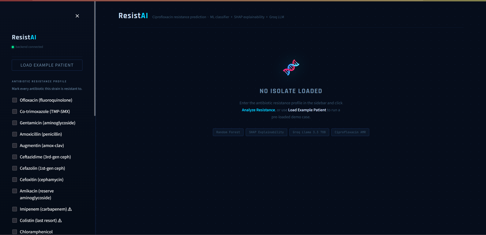
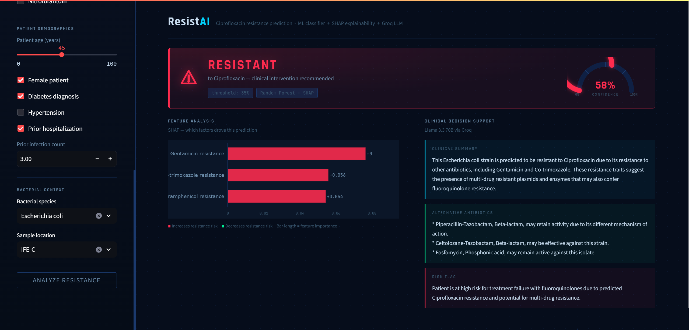
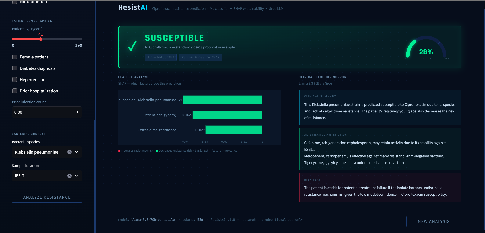

# ResistAI: Antibiotic Resistance Prediction & Clinical Decision Support

> An AI powered tool that predicts Ciprofloxacin resistance in bacterial isolates, explains the biological reasoning behind each prediction, and recommends alternative antibiotics in plain clinical language.

---

## The Problem

Antimicrobial resistance (AMR) is one of the most urgent threats in global healthcare. Bacteria evolve resistance faster than new antibiotics are developed, and clinicians often must choose antibiotics under time pressure with incomplete resistance data.

Existing tools predict resistance, but they don't explain _why_, and they don't tell the clinician _what to use instead_. ResistAI bridges that gap.

---

## Innovation Angle

Most resistance prediction tools stop at a binary label: **Resistant** or **Susceptible**.

ResistAI adds an **LLM-powered clinical decision layer** on top of the ML model:

1. A **Random Forest classifier** predicts Ciprofloxacin resistance from the bacterial isolate's antibiotic profile and patient demographics
2. **SHAP explainability** identifies which features drove the prediction with biological context (not just bar charts)
3. **Groq's Llama 3.3 70B** translates the ML output into a clinical report: plain language explanation, ranked alternative antibiotics, and a risk flag for the medical chart

This is the pipeline clinicians actually need, not a black box, but a reasoning tool.

---

## Pipeline

```
Clinician Input (resistance profile + patient data)
        │
        ▼
FastAPI /recommend endpoint
        │
        ├──► Random Forest Classifier (sklearn)
        │         └── predict_proba() → Resistant / Susceptible + confidence
        │
        ├──► SHAP TreeExplainer
        │         └── Top 3 features driving the prediction + biological labels
        │
        └──► Groq LLM (Llama 3.3 70B)
                  └── Clinical Summary + Alternative Antibiotics + Risk Flag
                                    │
                                    ▼
                        Streamlit UI (clinician facing)
```

---

## Setup

**Prerequisites:** Python 3.10+, a [Groq API key](https://console.groq.com) (free tier)

**1. Clone the repository**

```bash
git clone https://github.com/SakshamKotecha05/ResistAI
cd ResistAI
```

**2. Create and activate a virtual environment**

```bash
python -m venv venv
venv\Scripts\activate        # Windows
# source venv/bin/activate   # macOS / Linux
```

**3. Install dependencies**

```bash
pip install -r requirements.txt
```

**4. Add your Groq API key**

Create a `.env` file in the project root:

```
GROQ_API_KEY=gsk_your_key_here
```

**5. Train the model**

```bash
python ml/train.py
```

This reads the AMR datasets from `data/`, trains the Random Forest classifier, and saves `ml/model.pkl`, `ml/feature_names.pkl`, and `ml/threshold.pkl`.

---

## Running the App

Open **two terminals** from the project root:

**Terminal 1: Backend (FastAPI)**

```bash
venv\Scripts\uvicorn app.main:app --reload   # Windows
# uvicorn app.main:app --reload              # macOS / Linux
```

API runs at `http://localhost:8000` · Swagger docs at `http://localhost:8000/docs`

**Terminal 2: Frontend (Streamlit)**

```bash
venv\Scripts\streamlit run frontend/streamlit_app.py   # Windows
# streamlit run frontend/streamlit_app.py               # macOS / Linux
```

UI opens at `http://localhost:8501`

---

## Usage

1. Open the Streamlit UI at `http://localhost:8501`
2. In the sidebar, check the antibiotics the bacterial strain is **resistant** to
3. Fill in patient demographics (age, sex, comorbidities, prior hospitalization)
4. Enter the bacterial species and sample collection location
5. Click **Analyze Resistance**

The results panel shows:

- **Prediction badge**: RESISTANT or SUSCEPTIBLE with confidence score
- **SHAP feature chart**: which factors drove the prediction and why (biologically)
- **Clinical Decision Support**: LLM-generated summary, alternative antibiotic options, and a chart ready risk flag

Use **⚡ Load Example Patient** to instantly populate a demo case (E. coli, ICU, female/45/diabetic) that reliably produces a Resistant prediction.

---

## Screenshots

**Dashboard: empty state (no isolate loaded)**


**Resistant prediction with SHAP feature analysis and clinical decision support**


**Susceptible prediction**


---

## Dataset Sources

| Dataset                          | Source                                     |
| -------------------------------- | ------------------------------------------ |
| Antimicrobial Resistance Dataset | [Mendeley Data](https://data.mendeley.com) |
| Multi-Drug Resistance Profiles   | [Kaggle](https://www.kaggle.com)           |

Datasets are not committed to this repository. Download them and place CSV files in the `data/` directory before running `ml/train.py`.

---

## Tech Stack

| Layer           | Technology              | Role                                       |
| --------------- | ----------------------- | ------------------------------------------ |
| Frontend        | Streamlit               | Clinical UI pure Python, no JS             |
| Backend         | FastAPI                 | REST API with Pydantic validation          |
| ML Model        | sklearn (Random Forest) | Resistance classification                  |
| Explainability  | SHAP (TreeExplainer)    | Feature importance with biological context |
| LLM Layer       | Groq API Llama 3.3 70B  | Clinical recommendation generation         |
| Visualizations  | Plotly                  | Interactive SHAP bar chart                 |
| Data Processing | pandas, numpy           | Preprocessing and feature engineering      |

---

## Project Structure

```
codecure-amr/
├── app/
│   ├── main.py          # FastAPI entry point /predict and /recommend endpoints
│   ├── predict.py       # ML inference + SHAP explanation engine
│   ├── llm.py           # Groq clinical decision layer
│   └── utils.py         # SHAP to biology bridge (feature labels + biological context)
├── ml/
│   ├── train.py         # Model training script
│   ├── preprocess.py    # Data cleaning and feature engineering
│   └── *.pkl            # Saved model artifacts (gitignored if >50MB)
├── frontend/
│   └── streamlit_app.py # Streamlit UI
├── data/                # Datasets (gitignored)
├── .env                 # API keys (gitignored never committed)
├── requirements.txt
└── README.md
```

---

_Built for CodeCure @ IIT BHU SPIRIT 2026 Track B: Antibiotic Resistance Prediction_
